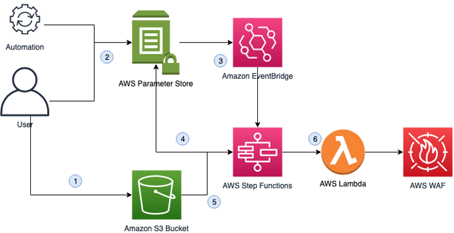

# Threat-Level-Automation-for-AWS-WAF

## Overview
This sample allows you to automatically switch between multiple, pre-defined versions of your AWS WAF WebACL, according to the conditions you are experiencing. 

For example, imagine you have three different WebACLs that you want to switch between, according to the threat level at any given time. When the threat level is low, you want a fairly permissive WebACL, to maximise the availability of your application. If you start to see an increase in certain metrics, you want to switch some of the rules from logging mode (COUNT action) to blocking mode (BLOCK action). And if you are really struggling with a large amount of unwanted traffic, you want to issue a CAPTCHA or CHALLENGE to all of your viewers, in an attempt to remove as much unwanted traffic as possible.

## Getting Started
The sample is deployed using a single CloudFormation stack. `template.yaml` should be deployed to either your preferred region (where AWS WAF is attached to regional resources) and/or to us-east-1 (where AWS WAF is attached to CloudFront resources)

## How it works
The solution works as follows:

1.	You create multiple versions of your AWS WAF WebACL, export them in JSON format, and store them in an Amazon Simple Storage Service (Amazon S3) bucket.
1.	Either a user, or an automated workflow, updates a parameter in Parameter Store, a capability of AWS Systems Manager, to specify the desired version of the WebACL to be applied.
1.	Updating the parameter triggers an Amazon EventBridge rule which rule invokes an AWS Step Functions Workflow
1.	The Step Functions Workflow reads parameters from Parameter Store to determine the current version of the WebACL, the desired version of the WebACL, the S3 bucket where the configuration is stored, and the WebACL scope (Cloudfront or Regional).
1.	If the desired version and current version are different, the Step Functions Workflow reads the WebACL for the desired version from the S3 bucket
1.	The Step Functions Workflow invokes AWS Lambda to update the WebACL in AWS WAF
1.	The Parameter Store parameters are then updated to reflect the change

## How to Deploy

The CloudFormation template included in this project `template.yaml` will deploy the following resources to your AWS Account:

- An Event Bridge rule to detect changes to the "desired" parameter in Parameter Store
- A Step Function to handle the majority of the updating logic
- A Lambda Function to actually update the WebACL
- An Eventbridge Rule which will trigger the step function
- Example Parameter Store parameters
- Related IAM roles/policies

### Setup instructions

- Create a new CloudFormation stack using `template.yaml` included in this repository. Note that if you want to use this with CloudFront, you must create the CloudFormation stack in the us-east-1 region
- Create an S3 bucket in the same region as this stack to hold your configuration files
- Export your WAF WebACL to JSON (use the console if you wish). Create multiple versions of this file with varying rules. You must name the files as follows:
    - `[webaclname]-[1|2|3].json`
    - eg. `my-first-webacl-1.json`, `my-first-webacl-2.json`, etc.
- Upload your json files into your S3 bucket
- Create parameters in SSM Parameter Store:
    - `/wafthreat/desired/[webaclname]`
    - `/wafthreat/current/[webaclname]`
    - `/wafthreat/config/[webaclname]`
- The desired and current parameter values should be either "1" "2" or "3"
- The config parameter value should be a json string. See the example parameter for the format.

## Using the solution

- Simply change the value of `/wafthreat/desired/[webaclname]` to either "1" "2" or "3" according to your preference. Within 30-60 seconds the WebACL will be updated. You can either do this manually using the console, or via an API call (triggered by a CloudWatch Alarm, for example)

## Cleanup

- Delete the CloudFormation stack
- Delete the S3 bucket you created during setup, as well as its contents
- Delete any parameters you created in Parameter Store, which will have the prefix `/wafthreat/`

## Solution Cost

The overall cost of this solution is very low given its serverless architecture.
There is no charge for Standard parameters in Parameter Store

Charges *may* be incurred for these components if outside the free tier:
* [AWS Step Functions](https://aws.amazon.com/step-functions/pricing/)
* [AWS Lambda](https://aws.amazon.com/lambda/pricing/)
* [Amazon EventBridge](https://aws.amazon.com/eventbridge/pricing/)
* [Amazon S3](https://aws.amazon.com/s3/pricing/)
* [AWS WAF](https://aws.amazon.com/waf/pricing/)

## Security

See [CONTRIBUTING](CONTRIBUTING.md#security-issue-notifications) for more information.

## License

This library is licensed under the MIT-0 License. See the LICENSE file.

